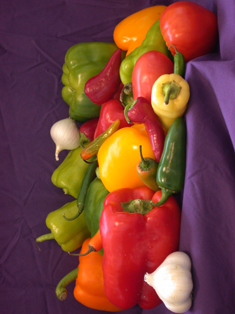
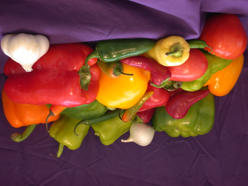
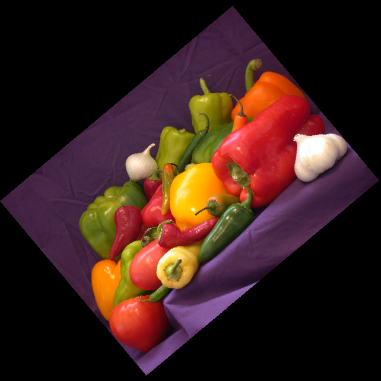
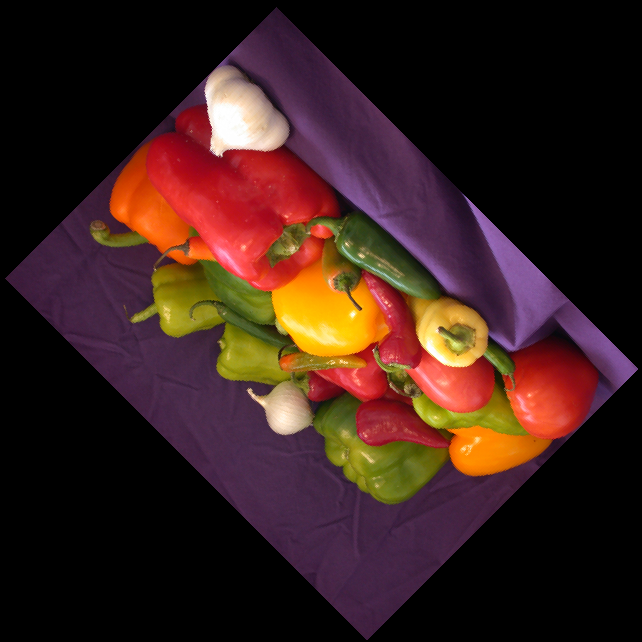

# Rotate-Image
Rotate image by the given angle (in degrees) in counter-clockwise direction.

Input image:

Image rotate at 90 degrees:

Image rotate at 180 degrees:

Image rotate at 40 degrees:

Image rotate at 135 degrees:

